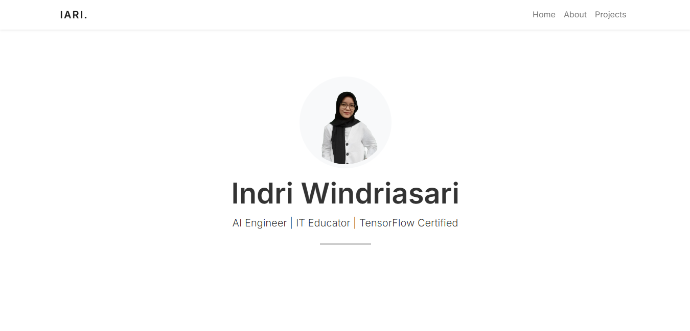
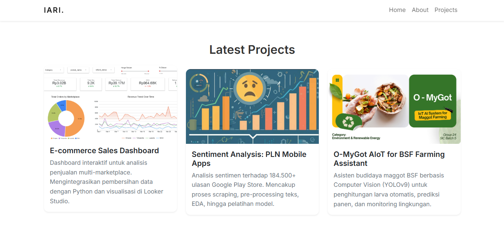

# Personal Portfolio - Indri Windriasari

A sleek, **clean-minimalist** personal portfolio website designed to showcase my professional journey as an **AI Engineer** and **IT Educator**. This project serves as a digital hub for my Machine Learning research, IoT implementations, and contributions to tech education.

---
## Preview
<p align="center">
  
  
</p>

## About This Project
The primary goal of this website is to provide a professional and modern interface for recruiters and collaborators to explore my technical expertise.

**Key Focus Areas:**
- **AI & Computer Vision:** Highlighting my TensorFlow Developer certification and YOLOv9 implementations.
- **Data Analytics:** Showcasing my ability to handle large-scale datasets (180k+ records).
- **Minimalist UX:** Using a distraction-free design to emphasize content and technical skills.

## Tech Stack
This website is built with a lightweight approach to ensure fast performance and high responsiveness:

| Technology | Purpose |
| :--- | :--- |
| **HTML5** | Semantic content structure |
| **CSS3** | Custom styling & branding |
| **Bootstrap 5.0** | Responsive grid system & UI components |
| **Inter Font** | Modern typography for better readability |
| **Bootstrap Icons** | Minimalist vector icons |

## Key Features
* **Fully Responsive:** Optimized for Mobile, Tablet, and Desktop views.
* **Interactive Project Cards:** Integrated with `stretched-link` for direct navigation to GitHub repositories.
* **Modern UI:** Strategic use of whitespace and a monochromatic palette with professional blue accents.
* **Clean Code:** Well-documented HTML/CSS for easy maintenance.

## 📂 Struktur Folder
```text
📂 portfolio-iari
├── 📂 img           # Semua aset gambar (profil, thumbnail project)
├── index.html       # File utama website
├── style.css        # Custom styling & skema warna minimalist
└── README.md        # Dokumentasi proyek (file ini)
```

## Getting Started
1. Clone the repository:
   ```bash
   git clone [https://github.com/driins/website-portofolio/.git](https://github.com/driins/website-portofolio/.git)
2. Open index.html
